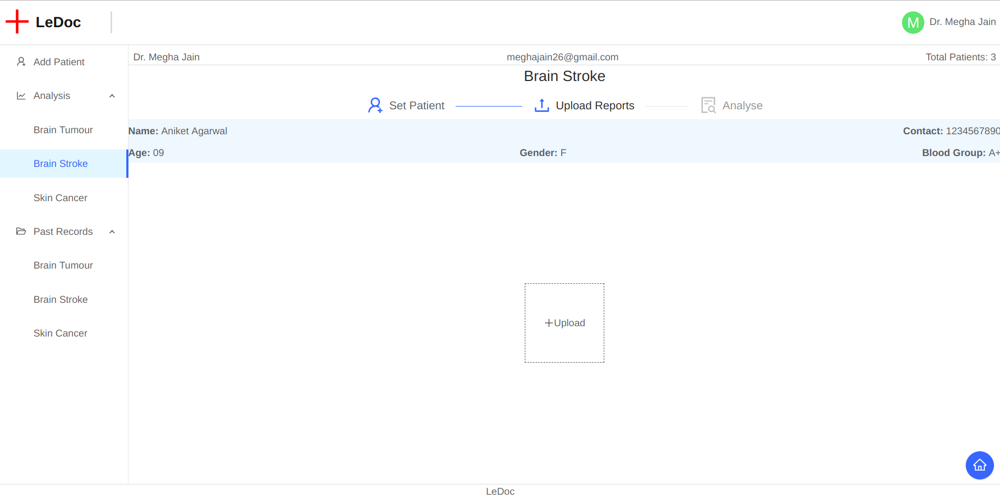
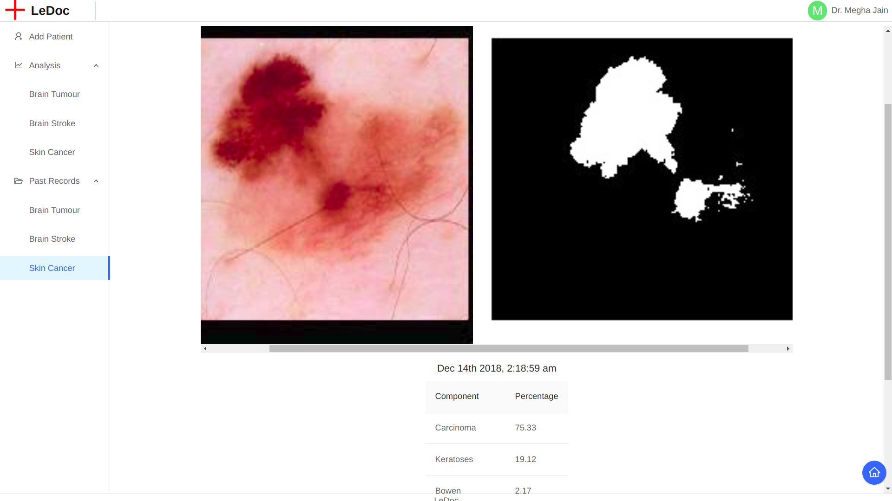
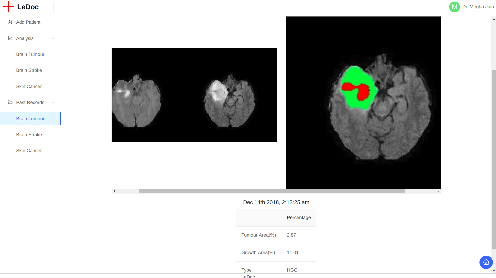
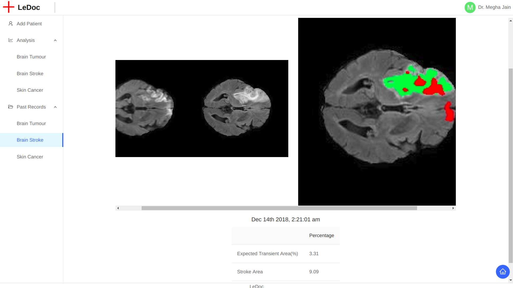

<h1> LeDoc </h1>

<h2> 1. Introduction </h2>

 The basic use case of this app is in the field of medical image analysis. With the help of various advances in the field of deep learning we wish to assist in the medical field.  Right now we are able to tackle some of the fatal diseases like Skin Cancer, Brain Tumor and Brain Cancer. Through our app, we wish to assist doctors in the preliminary stages of treatment of these diseases. For this, we use clustering for segmentation purposes, and for predicting the severity of the disease we use various computer vision techniques.

<h2> 2. Motivation </h2>

 The name of this project has been inspired from the famous <i>Image Classification model 'LeNet' by Yann LeCun</i>.The major motivation to take up this project came from <b>Enlitic</b>, a startup by <i>Jeremy Howard</i>. Their basic aim is to assist doctors by using latest advancements in the field of deep learning and hence easening out the burden faced by doctors due to increasing number of patients. For more information you can see <a href='https://www.enlitic.com/'>here</a>.
    
<h2> 3. Methodology</h2>
<h3> A. Skin Cancer </h3>

The whole dataset for this was obtained from <a href='https://challenge2018.isic-archive.com/'>ISIC challenge 2018</a>. For this task, we ask the user to input a <i>224*224</i> skin lesion image. For the segmentation purposes we used simple K-Means clustering techniques(<i>k=2</i>). The classification of the skin lesions was on these 7 categories:<i> Melanoma, Melanocytic Nevus, Basal Cell Carcinoma, Acinic Keratosis, Benign Keratosis, Dermatofibroma, Vascular Lesion.</i> More information regarding these types can be collected from <a href='https://challenge2018.isic-archive.com/task3/'>here</a>   The classification into these 7 categories was done by training a ConvNet. For training we used a pretrained VGG_16 network and used transfer learning by removing all the fully connected layers and then attaching our own 5 fc layers and then training accordingly on the dataset. The whole ConvNet model is made using <i>Pytorch</i>. 

<h3> B. Brain Tumor </h3>

The whole dataset for this was obtained from <a href='http://www.isles-challenge.org/ISLES2015/'>ISLES challenge 2015</a>.  For the processing of this task, the user is made to upload a <i>zip file cotaining two kinds of MRI scans, namely <b>t1c</b> and <b>flair</b></i>. These two different kinds of MRI sequences are basically essential to get different kind of information about the patient's brain state. For the segmentation purpose we used K-Means clustering techniques(<i>k=3</i>). We apply the clustering process on both the types of sequences separately and then combine them by using color coding.

<ul>
    <li>The red part represents the major tumor area</li>
    <li>The green part represents the area that is the most affected by the tumor region and hence most likely to be the next affected</li>
</ul>

Apart from this, we also show the respective percentage area of these two regions w.r.t the brain area so as to help doctors in better analysis of the affected region. We also further classify the severity of the disease into <i>HGG</i> or <i>LGG</i> which is basically high grade or low grade tumor, done using simple thresholding by analyzing the area affected

<h3> C. Brain Stroke </h3>

The whole dataset for this was obtained from <a href='http://braintumorsegmentation.org/'>BraTS challenge 2016</a>.  For the processing of this task, the user is made to upload a <i>zip file containing two kinds of MRI scans, namely <b>dwi</b> and <b>flair</b></i>. These two different kinds of MRI sequences are basically essential to get different kind of information about the patient's brain state. For the segmentation purpose we used K-Means clustering techniques(<i>k=3</i>). We apply the clustering process on both the types of sequences separately and the combine them by using color codind.

<ul>
    <li>The red part shows the transient stroke area</li>
    <li>The green part shows the main stroke area</li>
</ul>

Apart from this, we also show the respective percentage area of these two regions w.r.t the brain area so as to help doctors in better analysis of the affected region. This can certainly help doctors determine whether the condition of the patient is worsening or improving

<h2> 4. Testing </h2>

Firslty download the pretrained model for classification from <a href='https://drive.google.com/file/d/1rOGo8Lc9mvboVdcxb473tnrAglQ7_QnI/view?usp=sharing'>here</a>. Now place this file in the directory <i>le_doc/skin_cancer</i>

Clone both the repositories containing the backend and frontend for the app. Opening a terminal session from the home directory.

``
cd le_doc_fronted  
``

``
npm start
``

Opening another terminal session from the home directory

``
cd le_doc
``

``
source .env/bin/activate  
``

``
pip install -r requirements.txt  
``

``
python manage.py runserver
``

 Also to test the results you can download the refined dataset with all the preprocessing already done:
    <a href='https://drive.google.com/file/d/1Z86Q54PLaDp65N0tQhwGbnL2FTaDytA-/view?usp=sharing'>Skin Cancer</a>, <a href='https://drive.google.com/file/d/1NbTfnIuRVuPyuXOshbvT2W8tGMtvPFi4/view?usp=sharing'>Brain Tumor</a>, <a href='https://drive.google.com/file/d/1TMEo87_R9_G-2JOx6Q-UWW0aOM6lwj4t/view?usp=sharing'>Brain Stroke</a>.

<h2> 5. Results </h2>
<h3> A. Skin Cancer </h3>

 Through our techniques for segmentation we were able to achieve a Jaccard index of about 0.78, averaged on a dataset of 100 images. Also the top-3 accuracy of our classification model is of about 85%.

<h3> B. Brain Tumor </h3>

 Through our techniques for segmentation we were able to achieve a Jaccard index of about 0.75, averaged on a dataset of 100 zip files.

<h3> C. Brain Stroke </h3>

 Through our techniques for segmentation we were able to achieve a Jaccard index of about 0.75, averaged on a dataset of 100 zip files.

<h2> 6. Further development of the project </h2>
<ol>
    <li>To further extend the project, we will also be incorporating lung cancer detection and segmentation and some other diseases which require preliminary stages of treatment so as to assist the doctors and hence lessen up their work load.</li>
    <li>We will also be further imporving the accuracy of the classification model, by trying out better models and even increasing our dataset size.</li>
    <li>Also we will also be implementing more advanced segmentation techniques like Mask RCNN so as to improve the results.</li>
    <li>During the development of the project, we also tested genetic algorithms and swarm optimization, which did improve the segmentation results for all three cases but took a heavy toll on the processing time and hence were not incorporated in the final version of the project. So we would also be further investigating on the feasibility of their incoporation in the project by optimizing the algorithm.</li>
</ol>

<h2> Contributors </h2>
<b><ol>
    <li>Aniket Agarwal</li>
    <li>Praduman Goyal</li>
    <li>Akshit Mittal</li>
</ol></b>
